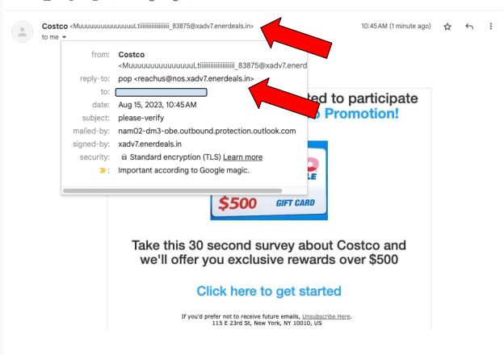
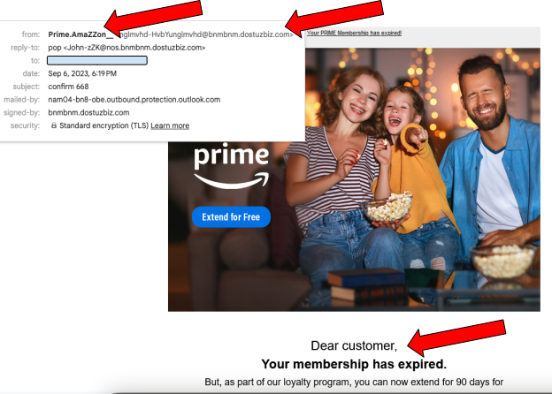
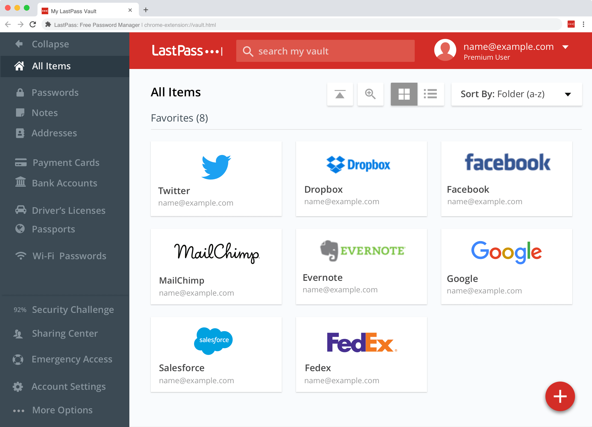
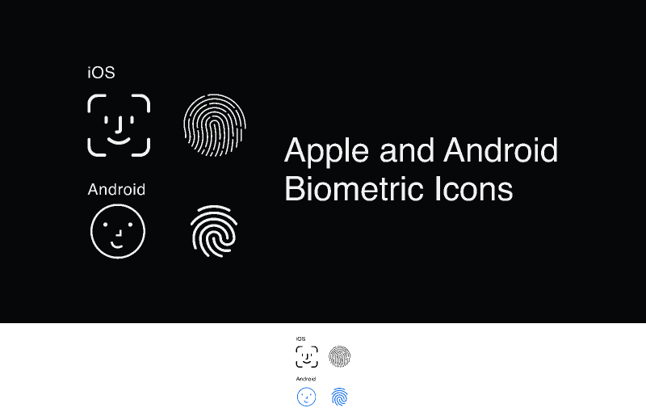

# How Not to Get Hacked

--

## Who am I?

 <!-- .element height="30%" width="30%" -->

- an IT professional with experience helping older folks deal with IT problems.

--

## Agenda

- To Trust or Not to Trust
- Phishing
- Social Engineering
- Password Security
- Multifactor Authentication

---

## To Trust or Not to Trust

 <!-- .element height="30%" width="30%" -->

--

### Default: Don't Trust Anyone

- Scammers are everywhere
- Scammers are persistent

--

### Find Your Tech buddy

 <!-- .element height="30%" width="30%" -->

1. Someone you _trust_
1. Someone you can go can easily get in touch with

---

## Phishing

_An attempt by an attacker to hook you_

 <!-- .element height="30%" width="30%" -->

--

## Phishing Examples

--

Phone conversation:

<section style="text-align: left;">

_Scammer: Mr./Ms. \_\_\_\_, we did not receive your taxes here at the IRS. Not filing your taxes on time can result in significant financial penalties._

_Mr./Ms. \_\_\_\_: Well, I did file my taxes, did they just not come through?_

_Scammer: We never received them. Sir this is a pressing matter, and we need some information to continue... What is your social security number?_

</section>

--

 <!-- .element height="100%" width="100%" -->

--
 <!-- .element height="150%" width="100%" -->

--

 <!-- .element height="60%" width="50%" -->

--

## Phishing Giveaways

- Unknown sender address
- Either something enticing or threatening
- Pretending to be someone of authority

--

## What to do?

- Check with a tech buddy if suspicious
- Block the sender and report spam

---

## Social Engineering

 <!-- .element height="30%" width="30%" -->

--

## The "janitor" bank robber

1. A person with pretend authority
1. Gains access to something secret
1. Appears as if meant to be there

--

## Social Engineering Examples

- "You have a virus, please download this app to let us screenshare and fix it"
- "Your account has been hacked, please work with our IT support to unfreeze it."
- (Catfishing) "I love you and I want to move to the US, I just need money to make it happen."

--

## Take it from the IRS

> The IRS doesn't initiate contact with taxpayers by email, text messages or social media channels to request personal or financial information. This includes requests for PIN numbers, passwords or similar access information for credit cards, banks or other financial accounts.

---

## Password Security

 <!-- .element height="30%" width="30%" -->

--

## What's the Internet?

<iframe width="1927" height="672" src="https://www.youtube.com/embed/s92IDLfRRyc" title="Ralph Breaks the Internet | &quot;We Are In The Internet&quot; Clip" frameborder="0" allow="accelerometer; autoplay; clipboard-write; encrypted-media; gyroscope; picture-in-picture; web-share" allowfullscreen></iframe>

--

## Accounts?

- Accounts are your identity on the internet in a specific place
- Someone who can access your account _can impersonate you_

--

## Accounts compromises

- Data breaches
- Brute force attacks
- Credential stuffing

--

## Golden Rules of Account Security

- Never reuse the same password
- Never use a weak, easy to guess password

--

## Best way to accomplish the above?

- A Password Manager

--

## LastPass (as an example)

--

## Good Password Managers?

- LastPass
- 1Password
- Bitwarden
- Keeper

Ask your tech buddy!

---

## MultiFactor

## Authentication (MFA/2Factor)

 <!-- .element height="30%" width="30%" -->

--

## What is MFA?

A way to secure your account beyond a password

--

## What kinds are there?

(From strongest to weakest)

1. Physical 2 Factor Keys
1. Biometrics (Face ID, Thumbprint)
1. Generated Codes (Authenticator Apps)
1. Phone Text Messages/ Phone Calls
1. Codes Received via Email

--

## What should I use?

The strongest you can!

--

---

## Questions?

--

## Picture attributions

<a href="https://www.flaticon.com/free-icons/study" title="study icons">Study icons created by Freepik - Flaticon</a>

<a href="https://www.flaticon.com/free-icons/phishing" title="phishing icons">Phishing icons created by kerismaker - Flaticon</a>

<a href="https://www.flaticon.com/free-icons/trust" title="trust icons">Trust icons created by rukanicon - Flaticon</a>

<a href="https://www.flaticon.com/free-icons/janitor" title="janitor icons">Janitor icons created by Leremy - Flaticon</a>

<a href="https://www.flaticon.com/free-icons/password" title="password icons">Password icons created by Freepik - Flaticon</a>

<a href="https://www.flaticon.com/free-icons/authentication" title="authentication icons">Authentication icons created by monkik - Flaticon</a>
