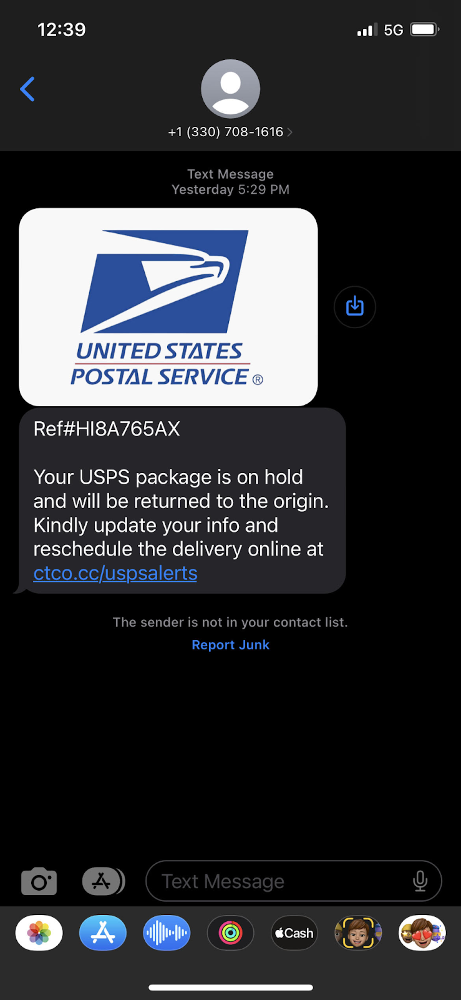

# Don't Get Hacked

--

## Who am I?

 <!-- .element height="30%" width="30%" -->

- an IT professional with experience helping older folks deal with IT problems.

--

## Agenda

- TL;DR
- To Trust or Not to Trust
- Phishing
- Social Engineering
- Password Security
- Multifactor Authentication
- Recap

---

## Too Long; Didn't Read (TL;DR)

1. Avoid the bad things on the internet (Diet)

 <!-- .element height="30%" width="30%" -->
--

2. Embrace tools that make things more secure (Exercise)

 <!-- .element height="30%" width="30%" -->

---

## To Trust or Not to Trust

 <!-- .element height="30%" width="30%" -->

--

### Question: Who should you trust online?

--

### Answer: NO ONE

- Scammers are everywhere
- Scammers are persistent

--

### Find Your Tech buddy

 <!-- .element height="30%" width="30%" -->

1. Someone you _trust_
1. Someone you can go can easily get in touch with (friend, family member, neighbor)

--

### What to do when bad things happen?

1. Close the device/ turn it off/ unplug it
1. Find/contact your tech buddy and tell them what happened

 <!-- .element height="40%" width="40%" -->

---

## Phishing

_An attempt by an attacker to hook you_

 <!-- .element height="30%" width="30%" -->

--

## They are EVERYWHERE

--

## Phishing Examples

--

Phone conversation example:

<section style="text-align: left;">

_Scammer: Mr./Ms. \_\_\_\_, we did not receive your taxes here at the IRS. You could be in big trouble!_

_Mr./Ms. \_\_\_\_: Well, I did file my taxes, did they just not come through?_

_Scammer: We never received them. Sir/Ma'm this is a pressing matter, to continue... What is your social security number?_

</section>

--

 <!-- .element height="100%" width="100%" -->

--
 <!-- .element height="150%" width="100%" -->

--

 <!-- .element height="60%" width="50%" -->

--

## Phishing Giveaways

- Unknown sender address
- Either something enticing or threatening
- Pretending to be someone of authority

--

## What to do?

- Check with a tech buddy if you are suspicious
- Block the sender and report spam

 <!-- .element height="10%" width="10%" -->

--

## Social Engineering

 <!-- .element height="30%" width="30%" -->

--

## The "janitor" bank robber

1. A person with pretend authority
1. Gains access to something secret
1. Appears as if meant to be there

--

--

## Social Engineering Examples

- "You have a virus, please download this app to let us screenshare and fix it"
- "Your account has been hacked, please work with our IT support to unfreeze it."
- (Catfishing) "I love you and I want to move to the US, I just need money to make it happen."

--

## Take it from the IRS

> The IRS doesn't initiate contact with taxpayers by email, text messages or social media channels to request personal or financial information. This includes requests for PIN numbers, passwords or similar access information for credit cards, banks or other financial accounts.

---

## Password Security

 <!-- .element height="50%" width="50%" -->

--

 <!-- .element height="100%" width="100%" -->

--

## Accounts?

- Your identity on the internet, per website
- Whoever can access your account _can **be** you_

--

## Accounts compromises

- Data breaches (stuff leaked)
- Brute force attacks (bots guess your password)
- Credential stuffing (bots reuse your password)

 <!-- .element height="30%" width="30%" -->

--

## Golden Rules of Passwords

--

## Best way to follow the rules?

- A Password Manager

 <!-- .element height="50%" width="50%" -->

--

## LastPass (as an example)

--

## Good Password Managers?

- LastPass
- 1Password
- Bitwarden
- Keeper

Ask your tech buddy!

---

## MultiFactor

## Authentication (MFA/2Factor)

 <!-- .element height="30%" width="30%" -->

--

## What is MFA?

A way to secure your account beyond a password

 <!-- .element height="10%" width="10%" -->

--

## Example: The Doorman

- Your Key == Password
- Another Factor == The Doorman

--

## What kinds are there?

(From strongest to weakest)

1. Physical 2 Factor Keys
1. Biometrics (Face ID, Thumbprint)
1. Generated Codes (Authenticator Apps)
1. Phone Text Messages/ Phone Calls
1. Codes Received via Email

--

## What should I use?

The strongest you can!

--

---

## Recap

--

- _Keep the bad things out_ with the help of your **tech buddy** + **knowing what to avoid** (diet)
- _Keep your accounts secure_ with a **password manager** and **multifactor authentication** (exercise)

--

 <!-- .element height="30%" width="30%" -->

 <!-- .element height="30%" width="30%" -->

---

## Questions?

## Stories Folks Want to Share?

--

## Picture attributions

<a href="https://www.flaticon.com/free-icons/study" title="study icons">Study icons created by Freepik - Flaticon</a>

<a href="https://www.flaticon.com/free-icons/phishing" title="phishing icons">Phishing icons created by kerismaker - Flaticon</a>

<a href="https://www.flaticon.com/free-icons/trust" title="trust icons">Trust icons created by rukanicon - Flaticon</a>

<a href="https://www.flaticon.com/free-icons/janitor" title="janitor icons">Janitor icons created by Leremy - Flaticon</a>

<a href="https://www.flaticon.com/free-icons/password" title="password icons">Password icons created by Freepik - Flaticon</a>

<a href="https://www.flaticon.com/free-icons/authentication" title="authentication icons">Authentication icons created by monkik - Flaticon</a>

<a href="https://www.freepik.com/search">Icon by Freepik</a>
